# MicroSpring

A minimal HTTP server and IoC framework built from scratch in Java, demonstrating reflection-based dependency scanning, annotation-driven routing, and static file serving — without any external dependencies.

Built as a course project for *Tecnologías y Arquitecturas Horizontales (TDSE)* at Escuela Colombiana de Ingeniería Julio Garavito.

---

## Table of Contents

- [Overview](#overview)
- [Architecture](#architecture)
- [Annotations](#annotations)
- [Endpoints](#endpoints)
- [Getting Started](#getting-started)
- [Running Modes](#running-modes)
- [Project Structure](#project-structure)
- [Deployment on AWS](#deployment-on-aws)
- [Author](#author)

---

## Overview

MicroSpring is a lightweight framework that mimics the core behavior of Spring Boot through:

- A raw Java HTTP server that parses HTTP/1.1 GET requests
- An IoC container that scans the classpath for `@RestController` classes and registers their `@GetMapping` methods as routes
- Support for query parameters via `@RequestParam` with default values
- Static file serving (`text/html`, `text/css`, `image/png`) from the classpath

The included demo application exposes information about the single *aorahe* by *daxxsb* (2026), serving both dynamic controller responses and static assets.

---

## Architecture

```
Request
  │
  ▼
HttpServer.procesarSolicitud()
  │
  ├── /static/** ──► servirArchivoEstatico()   (reads from classpath)
  │
  └── registered route ──► ejecutarHandler()
                               │
                               └── reflection: resolves @RequestParam args
                                   └── method.invoke(instance, args)
```

**Component responsibilities:**

| Class | Responsibility |
|---|---|
| `MicroSpringBoot` | Entry point. Scans classpath for `@RestController` classes and wires routes into the server |
| `HttpServer` | Accepts TCP connections, parses HTTP request lines, dispatches to handlers or static files |
| `@RestController` | Marks a class as a web component discoverable by the framework |
| `@GetMapping` | Binds a method to a GET route |
| `@RequestParam` | Binds a method parameter to a query string value |

---

## Annotations

### `@RestController`
Applied at the class level. Signals the framework to instantiate the class and register its mapped methods as HTTP handlers.

```java
@RestController
public class HelloController { ... }
```

### `@GetMapping(String value)`
Applied at the method level. Registers the method as the handler for the specified GET route. Return type must be `String`.

```java
@GetMapping("/")
public String inicio() {
    return "<h1>Hello</h1>";
}
```

### `@RequestParam(value, defaultValue)`
Applied at the parameter level. Resolves the parameter value from the request query string. Falls back to `defaultValue` if the key is absent.

```java
@GetMapping("/greeting")
public String saludar(@RequestParam(value = "name", defaultValue = "Mundo") String nombre) {
    return "<h1>Hola, " + nombre + "!</h1>";
}
```

---

## Endpoints

| Method | Route | Description |
|---|---|---|
| GET | `/` | Landing page with album cover and release info |
| GET | `/cancion` | Single details (title, artist, year, type) |
| GET | `/creditos` | Full production credits |
| GET | `/greeting?name={name}` | Dynamic greeting, defaults to *Mundo* |
| GET | `/static/aorahe.png` | Album cover image |
| GET | `/static/style.css` | Application stylesheet |

---

## Getting Started

### Prerequisites

- Java 21
- Maven 3.8+

### Clone and build

```bash
git clone https://github.com/Daxxsb/microspring-lab-aorahe
cd microspring-lab-aorahe
mvn compile
```

### Run

```bash
java -cp target/classes co.edu.escuelaing.MicroSpringBoot
```

The server starts on `http://localhost:8080`.

---

## Running Modes

### Automatic classpath scan (default)

When invoked with no arguments, the framework scans all directories in the classpath for `.class` files, loads every class annotated with `@RestController`, and registers their routes automatically.

```bash
java -cp target/classes co.edu.escuelaing.MicroSpringBoot
```

### Explicit class loading

Pass a fully qualified class name as an argument to load a single controller. Useful for isolated testing.

```bash
java -cp target/classes co.edu.escuelaing.MicroSpringBoot co.edu.escuelaing.controllers.GreetingController
```

---

## Project Structure

```
src/
└── main/
    ├── java/
    │   └── co/edu/escuelaing/
    │       ├── MicroSpringBoot.java          # Entry point and classpath scanner
    │       ├── annotations/
    │       │   ├── GetMapping.java
    │       │   ├── RequestParam.java
    │       │   └── RestController.java
    │       ├── controllers/
    │       │   ├── HelloController.java      # GET /
    │       │   ├── SongController.java       # GET /cancion, GET /creditos
    │       │   └── GreetingController.java   # GET /greeting
    │       └── server/
    │           └── HttpServer.java           # HTTP server and request dispatcher
    └── resources/
        └── static/
            ├── aorahe.png                    # Album cover
            └── style.css                     # Dark red theme stylesheet
```

---

## Deployment on AWS

Deployed on AWS EC2 (t2.micro, Amazon Linux 2023, us-east-1).  
Public IP: `100.31.152.212` — `http://100.31.152.212:8080/`

### Steps followed

1. Launch an EC2 instance (Amazon Linux 2023, t2.micro)
2. Open inbound port `8080` in the instance Security Group
3. Install dependencies:
   ```bash
   sudo dnf install git -y
   sudo dnf install java-21-amazon-corretto -y
   export JAVA_HOME=/usr/lib/jvm/java-21-amazon-corretto.x86_64
   export PATH=$JAVA_HOME/bin:$PATH
   sudo dnf install maven -y
   ```
4. Clone the repository and compile:
   ```bash
   git clone https://github.com/Daxxsb/microspring-lab-aorahe
   cd microspring-lab-aorahe
   mvn compile
   ```
5. Run the server:
   ```bash
   java -cp target/classes co.edu.escuelaing.MicroSpringBoot
   ```
6. Access the application at `http://100.31.152.212:8080`

### Evidence

| | | | |
|---|---|---|---|
| 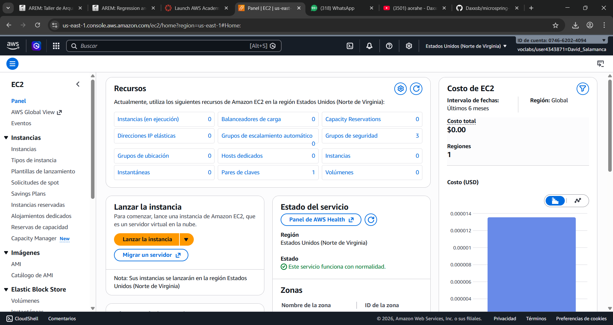 | 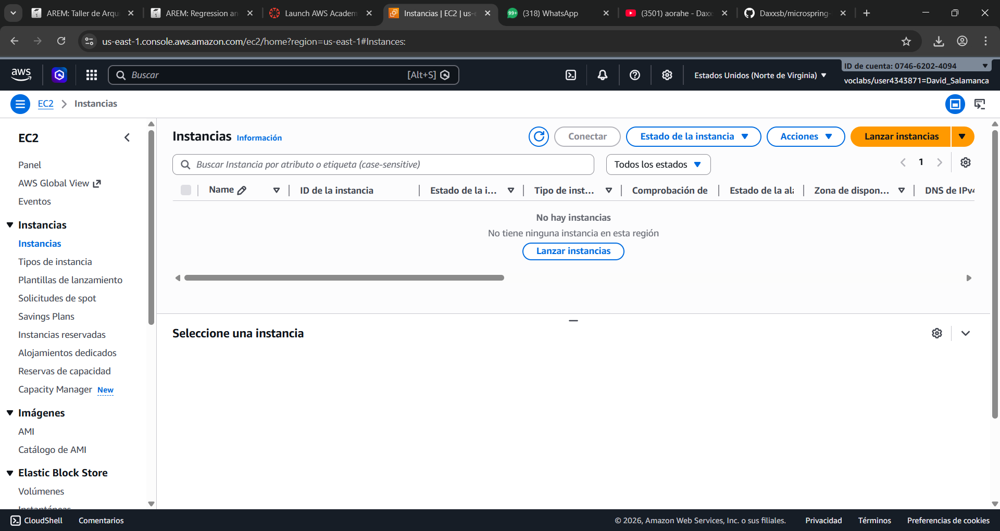 | 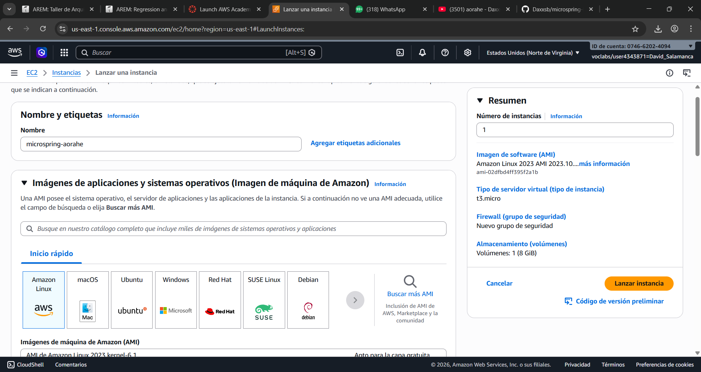 | 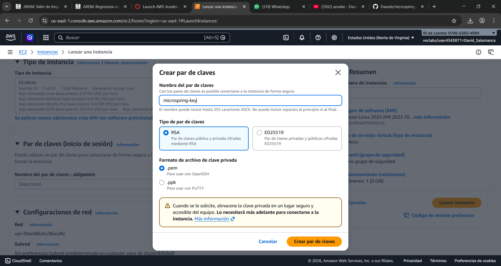 |
| 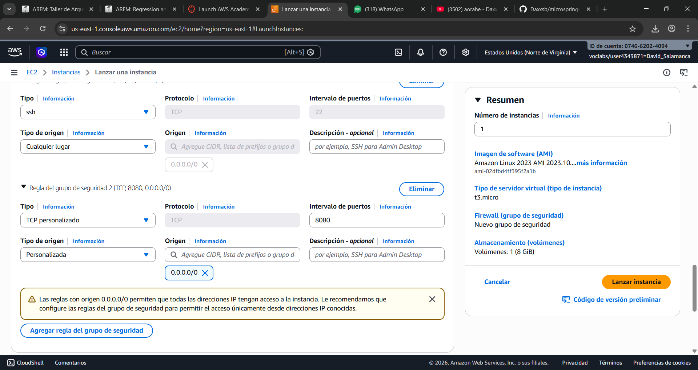 | 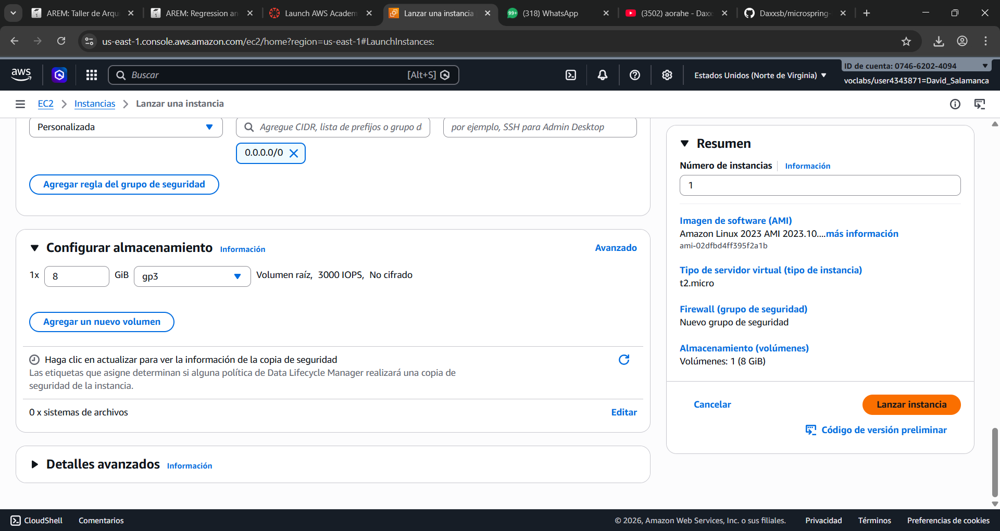 | 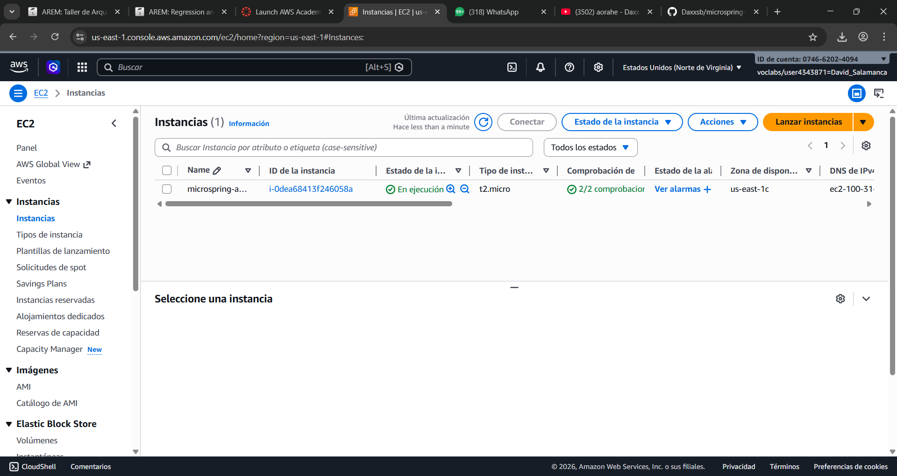 | 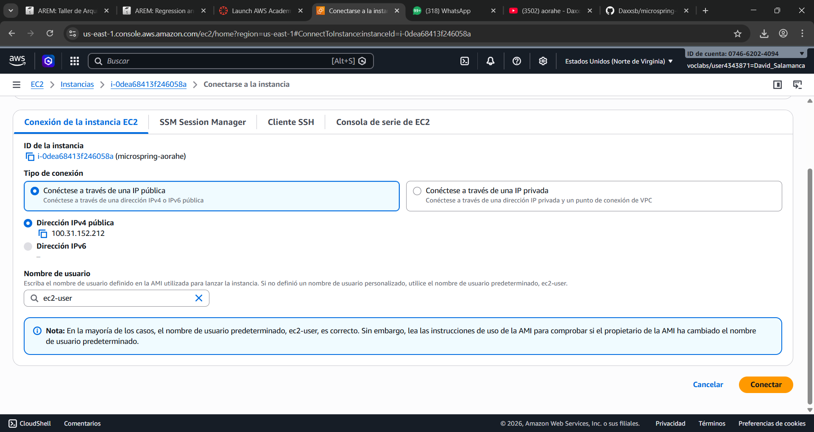 |
| 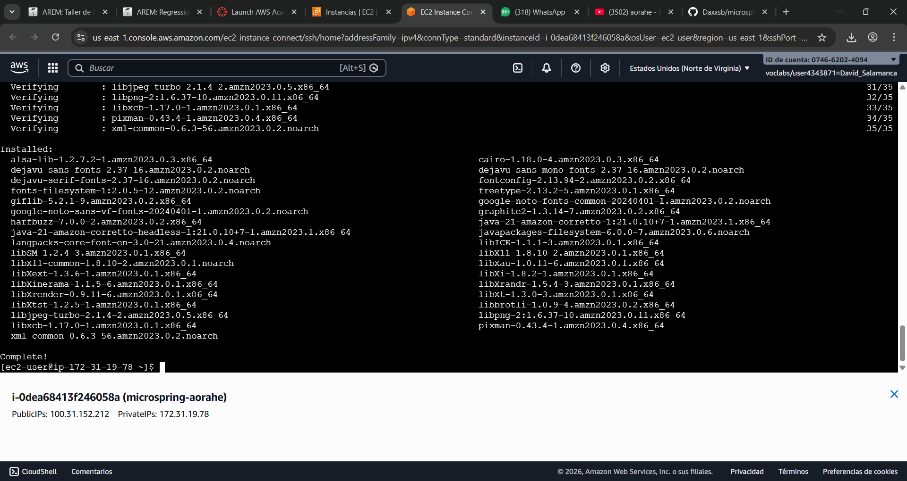 | 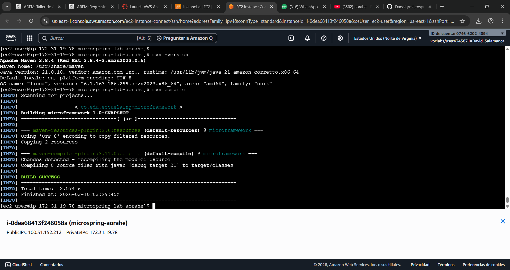 | 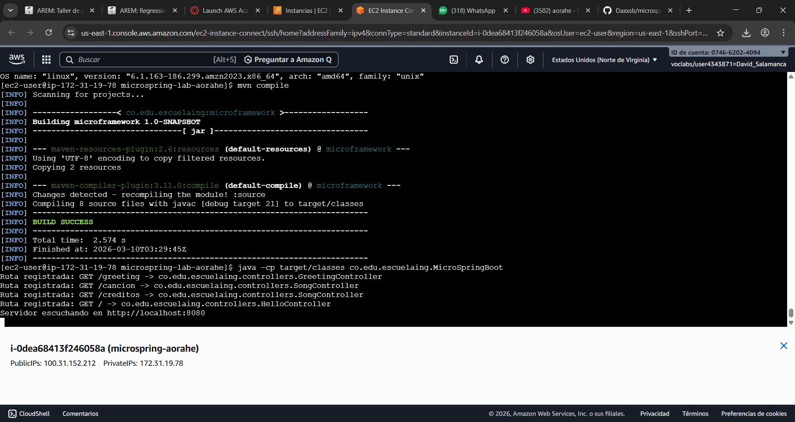 | 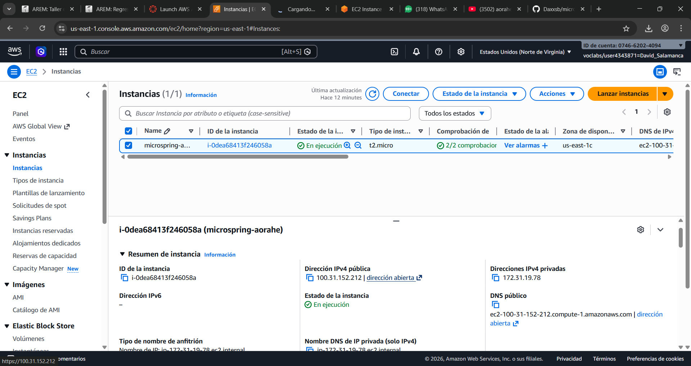 |
| 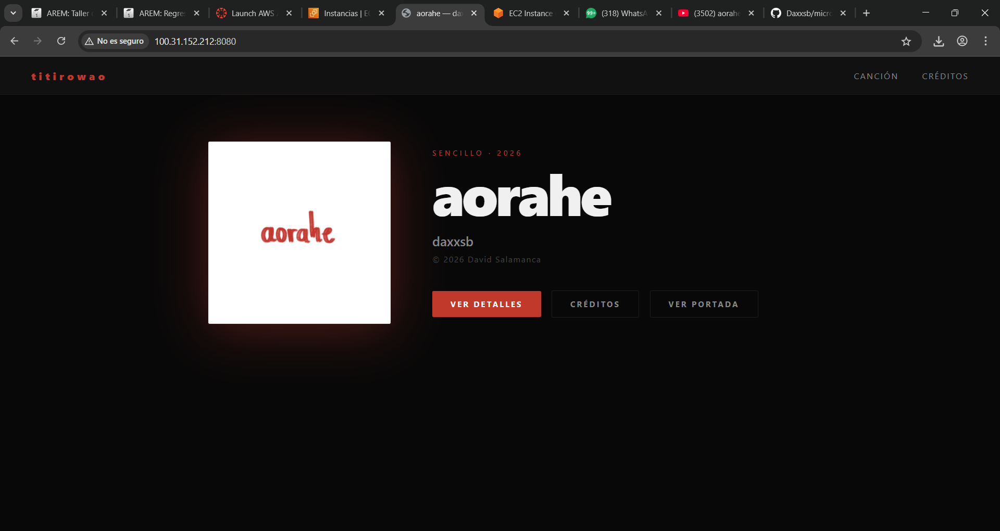 | 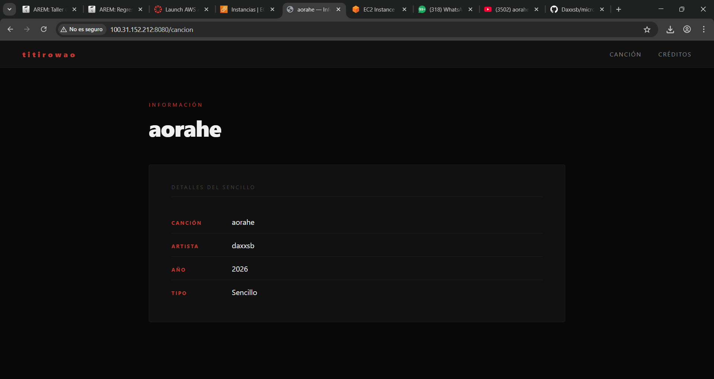 | 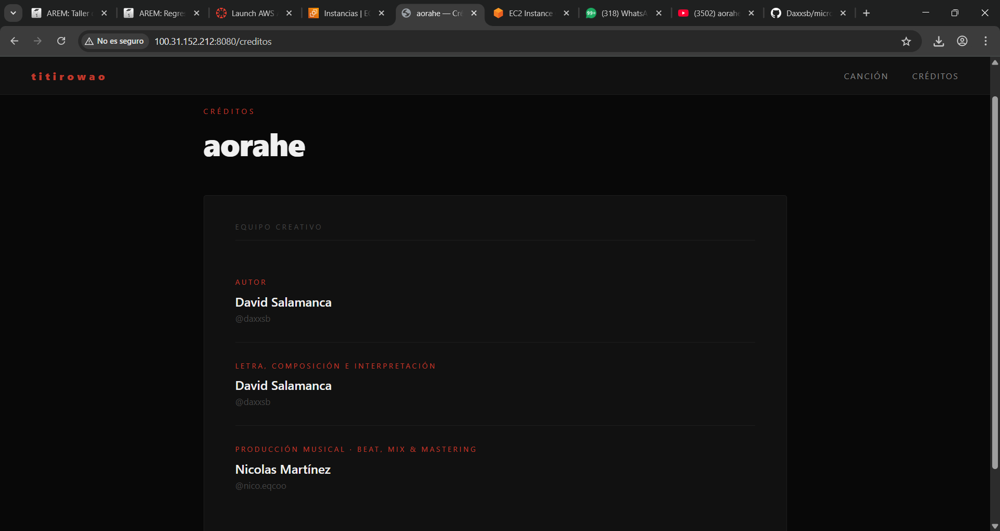 | 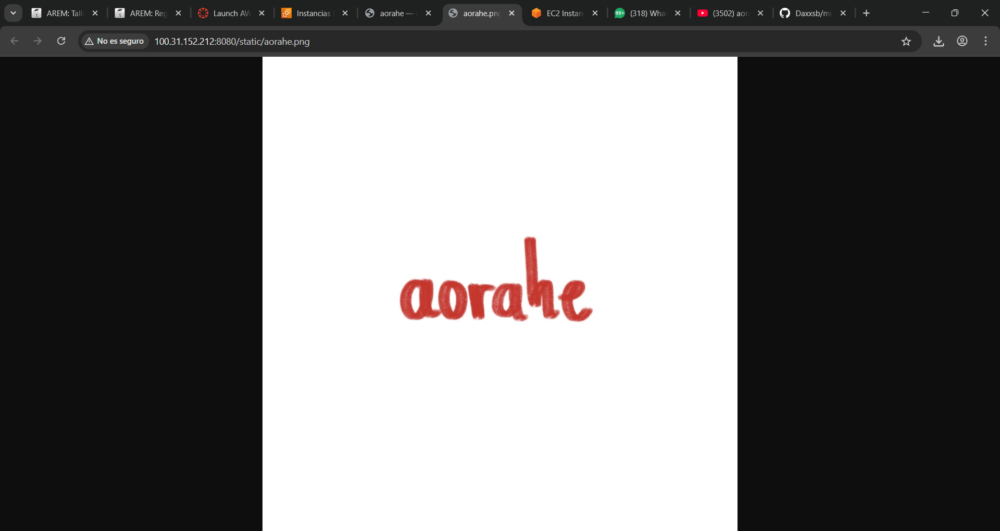 |

---

## Author

**David Salamanca**  
Escuela Colombiana de Ingeniería Julio Garavito  
GitHub: [@Daxxsb](https://github.com/Daxxsb)
